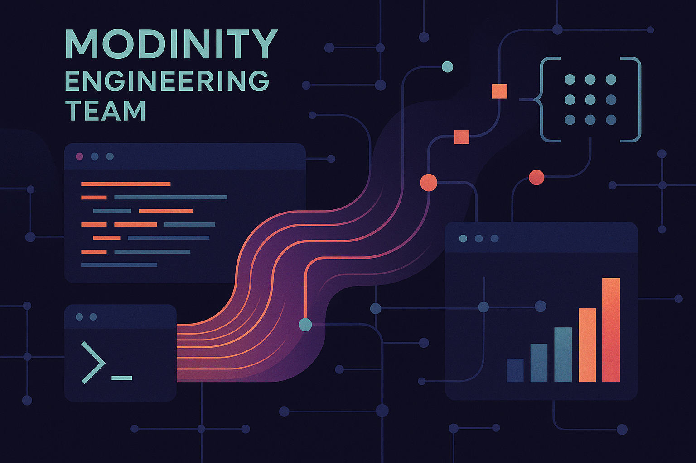

# 🌟 Modinity Group

Welcome to the official GitHub Organization of **Modinity Group**.  
This is where our **Engineering Team** builds, experiments, and innovates to support Modinity’s journey as a leading Indonesian fashion brand.

---

## 👁️ Our Vision
**Be the first Indonesian leading fashion brand in the World by spreading our authentic & fabulous product, for people to feel more confident about themselves.**

---

## 🚀 Our Mission
**We continuously grow our people and our brand to create authentic high-quality products and provide the best customer experiences.**

---

## 💻 About Modinity Engineering
Behind every great fashion brand is a strong technology backbone.  
At **Modinity Engineering**, we focus on:
- Building scalable systems to power e-commerce and operations  
- Automating workflows to improve efficiency and reliability  
- Designing integrations that connect Modinity with global platforms  
- Supporting our brand’s growth with innovative, tech-driven solutions  

---

## ✨ Our Values
- **Authenticity** → Staying true to our roots and identity  
- **Confidence** → Empowering people to feel proud of who they are  
- **Innovation** → Leveraging creativity and technology to shape the future  
- **Community** → Building meaningful connections with our customers and partners  

---

## 📫 Connect With Us
- 🌐 Website: [modinity.com](https://modinity.com/pages/about)  
- 📧 Email: tech@modinity.com  
- 💼 LinkedIn: [Our LinkedIn Page](https://www.linkedin.com/company/modinity)

---

✨ *At Modinity, fashion meets technology — and together, we create confidence.*  
